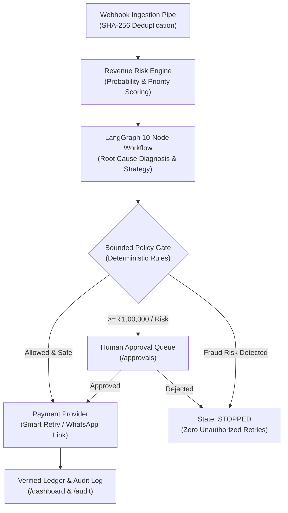

<div align="center">

# ⚡ RecoverAI

### Autonomous AI Revenue Recovery Agent for Modern Fintech & SaaS
**Razorpay AI Builder Challenge — Track 03: AI Revenue Recovery**

[](https://fastapi.tiangolo.com)
[](https://nextjs.org)
[](https://langchain.com)
[](https://sqlalchemy.org)
[](https://pytest.org)
[](LICENSE)

*Detect revenue leakage. Decide the safest intervention. Recover the money. Prove the outcome.*

</div>

---

## 🎯 Executive Summary

In subscription, e-commerce, and B2B workflows, **failed payments, cart abandonments, and overdue invoices represent up to 8–15% of annual gross merchandise value (GMV)**. Conventional recovery systems rely on brittle, blind cron retries or generic email blasts that annoy high-value VIPs, hammer expired cards, and trigger chargeback penalties on fraud transactions.

**RecoverAI** replaces dumb dunning rules with a **multi-stage, context-aware autonomous recovery agent**:
1. **Detects** failed payments, subscription dunning events, abandoned checkout carts, and overdue invoices in real-time via SHA-256 deduplicated webhooks.
2. **Diagnoses** technical and behavioral root causes using **LangGraph multi-node reasoning** and customer segmentation context.
3. **Validates** all proposed interventions against a **Deterministic Bounded Policy Engine** (retry caps, frequency limits, discount ceilings, and high-value approval thresholds).
4. **Executes** bounded recovery actions through Razorpay payment links, smart off-peak retries, and WhatsApp/Email reminders.
5. **Reconciles** every single recovered rupee in a verified financial ledger with an **immutable audit trail**.

---

## 🏛️ System Architecture



---

## 🚀 Key Differentiators & Features

### 1. Separation of AI Reasoning & Deterministic Governance
> **Core Axiom:** We use AI for root-cause reasoning, contextual interpretation, recovery explanation, and promise-to-pay extraction. **Deterministic code enforces money math, retry caps, discount limits, stopping rules, and audit logs.**

### 2. 10-Node LangGraph Recovery Agent Graph
- `load_case` → `load_customer_context` → `diagnose` (LLM root cause) → `calculate_recovery_score` → `select_strategy` (channel & timing) → `policy_check` (firewall) → `execute_or_escalate` → `verify_result` → `update_recovery_ledger` → `write_audit_log`.

### 3. Finite State Machine & Stopping Rules
- Full lifecycle governance: `DETECTED` → `DIAGNOSED` → `POLICY_CHECK` → `APPROVED` → `EXECUTING` → `AWAITING_RESULT` → `RECOVERED` / `STOPPED` / `ESCALATED`.
- Strict stopping rules on `MAX_RETRIES_EXCEEDED` (3), `MAX_MESSAGES_EXCEEDED` (2/week), `FRAUD_RISK_DETECTED`, or customer opt-out.

### 4. Side-by-Side Simulation Benchmark Engine (`/simulation`)
- Deterministic synthetic transaction batches (100, 500, 1000 transactions with configurable random seed).
- Compares **Baseline Dumb Retries** vs **RecoverAI Agent**:
  - **Baseline Recovery Rate**: `20.4%` (blind retries fail on expired cards, dropoffs, and invoices).
  - **RecoverAI Recovery Rate**: `77.8%` (**+57.4% incremental lift** and **+₹16.32 Lakhs** additional revenue per 100 cases).

### 5. Natural Language Promise-to-Pay Tracker (`/promises`)
- Extracts numerical amounts, target dates, and confidence scores from unstructured customer emails and WhatsApp responses (e.g. *"Will clear the pending 85000 invoice by Friday"*).
- Automated tracking: `PROMISED` → `WAITING` → `FULFILLED` / `BROKEN` → `ESCALATED`.

### 6. Human-in-the-Loop Approvals (`/approvals`)
- High-value transactions (>= ₹1,00,000), sensitive dunning actions, and broken promises require explicit operator sign-off before gateway dispatch.

### 7. Immutable Audit Trail (`/audit`)
- Every transition, policy decision, AI prompt metadata diff, and human operator action is cryptographically tracked in an immutable audit ledger.

---

## 🛠️ Monorepo Structure

```text
razpay_ai/
├── apps/
│   ├── api/                     # FastAPI Async Backend (Python 3.11+)
│   │   ├── app/
│   │   │   ├── agents/          # LangGraph 10-Node Graph, LLM Client & Schemas
│   │   │   ├── api/v1/          # Endpoints (Cases, Ledger, Approvals, Promises, Policies, Sim)
│   │   │   ├── core/            # Config, Logging, Async Database Engine
│   │   │   ├── db/              # Seeder with Indian fintech demo profiles
│   │   │   ├── models/          # SQLAlchemy 2.0 Domain Models
│   │   │   ├── policies/        # Bounded Policy Engine
│   │   │   ├── providers/       # Razorpay & Mock Payment Gateways
│   │   │   ├── risk/            # Revenue Risk & Priority Scoring Engine
│   │   │   ├── services/        # LedgerService, PromiseService, ApprovalService
│   │   │   ├── state_machine/   # Finite State Machine & Stopping Rules
│   │   │   └── webhooks/        # SHA-256 Deduplicated Webhook Processor
│   │   └── tests/               # 54 Pytest Unit, Integration & E2E Scenario Tests
│   └── web/                     # Next.js 14 App Router Frontend (Tailwind + Recharts)
│       ├── app/                 # /dashboard, /recovery, /simulation, /promises, /approvals, /policies, /audit
│       ├── components/          # Reusable UI, Charts, Tables, Navigation & Modals
│       └── lib/                 # Type-Safe API Client & Formatting Helpers
├── simulator/                   # Synthetic Batch Generator & Benchmark Runner
├── docker/                      # Multi-Stage Dockerfiles (API & Web)
├── docs/                        # Deep-Dive Technical Documentation
├── docker-compose.yml           # Complete PostgreSQL + Redis + API + Web Stack
└── README.md                    # Platform Overview & Reference
```

---

## ⚡ Quickstart Guide

### Prerequisites
- Python 3.11+
- Node.js 18+ & npm
- Git

### Option 1: Local Development

#### 1. Start FastAPI Backend
```bash
# Activate virtual environment
.\.venv\Scripts\Activate.ps1   # On Windows
source .venv/bin/activate      # On Linux/macOS

# Install dependencies
pip install -r apps/api/requirements.txt

# Run server with auto-seeding
cd apps/api
uvicorn app.main:app --reload --port 8000
```
Backend API will be live at `http://localhost:8000` (Swagger docs at `http://localhost:8000/docs`).

#### 2. Start Next.js Frontend
```bash
cd apps/web
npm install
npm run dev
```
Frontend Command Center will be live at `http://localhost:3000`.

---

### Option 2: Docker Compose (Full Stack)

```bash
docker-compose up --build
```
- **Web UI**: `http://localhost:3000`
- **FastAPI API**: `http://localhost:8000`
- **PostgreSQL**: `localhost:5432`

---

## 🧪 Comprehensive Test Suite

Run the full backend test suite covering unit tests, state machine transitions, policy firewalls, and end-to-end failure scenarios:

```bash
pytest apps/api/tests -v
```

```text
============================= 54 passed in 6.40s ==============================
apps/api/tests/test_agent.py ...                                         [  5%]
apps/api/tests/test_approvals.py ...                                     [ 11%]
apps/api/tests/test_audit_and_policies.py ...                            [ 16%]
apps/api/tests/test_e2e_recovery_scenarios.py .....                      [ 25%]
apps/api/tests/test_health.py ..                                         [ 29%]
apps/api/tests/test_ledger.py ....                                       [ 37%]
apps/api/tests/test_models.py ....                                       [ 44%]
apps/api/tests/test_policy_engine.py ......                              [ 55%]
apps/api/tests/test_promises.py ...                                      [ 61%]
apps/api/tests/test_providers.py .....                                   [ 70%]
apps/api/tests/test_risk_engine.py .....                                 [ 79%]
apps/api/tests/test_simulation.py ...                                    [ 85%]
apps/api/tests/test_state_machine.py .....                               [ 94%]
apps/api/tests/test_webhooks.py ...                                      [100%]
```

---

## 🌐 API Reference Overview

| Method | Route | Description |
|---|---|---|
| `GET` | `/api/v1/health` | System health check and uptime stats |
| `POST` | `/api/v1/webhooks/razorpay` | Ingest live Razorpay webhook events |
| `POST` | `/api/v1/webhooks/simulate` | Ingest simulated webhook event (deduplicated) |
| `GET` | `/api/v1/cases` | List recovery cases with multi-facet filters |
| `GET` | `/api/v1/cases/{id}` | Fetch deep investigation case dossier |
| `POST` | `/api/v1/cases/{id}/diagnose` | Run 10-node LangGraph recovery agent |
| `GET` | `/api/v1/ledger/metrics` | Reconciled revenue ledger metrics & breakdown |
| `GET` | `/api/v1/ledger/audit` | Query immutable audit log stream |
| `POST` | `/api/v1/simulation/run` | Execute side-by-side benchmark comparison |
| `GET` | `/api/v1/promises` | List customer promises to pay |
| `POST` | `/api/v1/promises/extract` | Extract promise commitment from text |
| `POST` | `/api/v1/promises/{id}/fulfill` | Reconcile fulfilled promise into ledger |
| `GET` | `/api/v1/approvals` | List pending human approval cases |
| `POST` | `/api/v1/approvals/{id}/decision` | Submit operator approval/rejection decision |
| `GET` | `/api/v1/policies/active` | Get active bounded recovery policy |
| `POST` | `/api/v1/policies` | Publish new versioned recovery policy |

---

## 📚 Technical Documentation

- [System Architecture](docs/ARCHITECTURE.md)
- [Agent & Reasoning Design](docs/AGENT_DESIGN.md)
- [Bounded Policy Engine](docs/POLICY_ENGINE.md)
- [Benchmark & Simulation Methodology](docs/BENCHMARK_RESULTS.md)

---

## 📄 License
This project is built for the Razorpay AI Builder Challenge and licensed under the MIT License.
