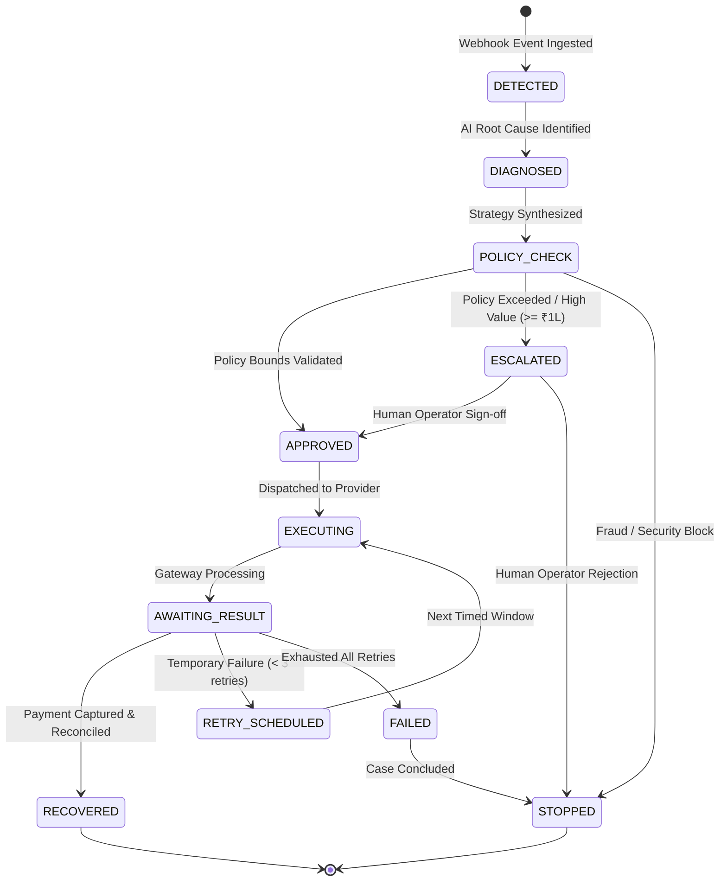

# RecoverAI System Architecture

RecoverAI is an enterprise-grade Autonomous AI Revenue Recovery Agent built specifically for the **Razorpay AI Builder Challenge (Track 03: AI Revenue Recovery)**.

---

## 1. System Philosophy: Separation of Reasoning and Execution

> **Core Axiom:**
> AI agents excel at **root-cause interpretation, context understanding, natural language promise extraction, and strategy synthesis**.
> Deterministic software must govern **financial ledger math, retry limits, discount caps, stopping rules, eligibility checks, and audit trails**.

```
                           ┌────────────────────────┐
                           │ Webhook Ingestion Pipe │
                           │ (SHA-256 Deduplication)│
                           └───────────┬────────────┘
                                       │
                                       ▼
                           ┌────────────────────────┐
                           │  Revenue Risk Engine   │
                           │(p-score, amount, tier) │
                           └───────────┬────────────┘
                                       │
                                       ▼
                       ┌────────────────────────────────┐
                       │ LangGraph Recovery Agent Graph │
                       │    (10-Node Autonomous Flow)   │
                       └───────────────┬────────────────┘
                                       │
                                       ▼
                       ┌────────────────────────────────┐
                       │  Bounded Policy Engine Gate    │
                       │   (Deterministic Safeguards)   │
                       └───────────┬────────┬───────────┘
                                   │        │
                   Allowed & Safe  │        │ Escalated / High Value
                                   │        │
                                   ▼        ▼
                      ┌────────────────┐ ┌────────────────────┐
                      │ Razorpay / Mock│ │ Human-in-the-Loop  │
                      │Payment Provider│ │   Approval Queue   │
                      └────────┬───────┘ └─────────┬──────────┘
                               │                   │
                               ▼                   ▼
                      ┌──────────────────────────────────────┐
                      │    Verified Ledger & Audit Trail     │
                      │  (Double-entry Reconciled Recovery)  │
                      └──────────────────────────────────────┘
```

---

## 2. Recovery State Machine & Stopping Rules

RecoverAI is backed by a strict Finite State Machine governing the lifecycle of every revenue recovery case:



### Deterministic Stopping Rules
Execution **must immediately halt** if any of the following occur:
1. `MAX_RETRIES_EXCEEDED`: Max 3 retry attempts reached.
2. `MAX_MESSAGES_EXCEEDED`: Frequency limit reached (2 messages in 7 days).
3. `FRAUD_RISK_DETECTED`: Security risk codes (`fraud_suspected`, `stolen_card`, `account_frozen`, `sanction_block`).
4. `CUSTOMER_OPT_OUT`: Explicit customer dunning opt-out.
5. `PAYMENT_RECOVERED`: Verified funds captured in ledger.

---

## 3. Database Schema Blueprint (SQLAlchemy 2.0)

| Table | Primary Purpose | Key Foreign Keys & Constraints |
|---|---|---|
| `customers` | Customer identity, segmentation (VIP/Enterprise/SMB/Retail), historical LTV | `id (PK)`, `email (Unique)` |
| `transactions` | Ledger of financial payment records | `customer_id (FK)`, `status`, `amount` |
| `payments` | Gateway attempt logs with failure taxonomies | `transaction_id (FK)`, `failure_code` |
| `subscriptions` | Recurring billing profiles and plans | `customer_id (FK)`, `status` |
| `invoices` | B2B invoices and overdue tracking | `customer_id (FK)`, `status`, `amount` |
| `recovery_cases` | Central state machine instance for revenue at risk | `customer_id (FK)`, `status`, `amount_at_risk`, `recovery_probability` |
| `recovery_actions` | Specific proposed and executed interventions | `recovery_case_id (FK)`, `policy_decision`, `status` |
| `recovery_attempts`| Physical provider API call outcomes | `recovery_case_id (FK)`, `provider_reference` |
| `recovery_policies`| Versioned, immutable financial policy configurations | `version (Unique)`, `is_active` |
| `promises_to_pay` | Natural language extracted payment commitments | `recovery_case_id (FK)`, `customer_id (FK)`, `status` |
| `webhook_events` | Ingested webhook logs with SHA-256 deduplication | `payload_hash (Unique Index)` |
| `audit_logs` | Immutable audit trail of every system action | `case_id (FK, Nullable)`, `actor_type`, `created_at` |

---

## 4. Multi-Tenant Service Architecture

- **`apps/api` (FastAPI 0.115+)**: Async backend serving REST endpoints, LangGraph state engine, database session lifecycle, and provider adapters.
- **`apps/web` (Next.js 14 App Router + Tailwind CSS + Lucide Icons + Recharts)**: Real-time Command Center, Deep Investigation Workbench, Simulation Sandbox, Promise Tracker, Approvals Queue, Policy Engine, and Audit Explorer.
- **`simulator`**: High-performance batch transaction generator and side-by-side benchmark runner.
